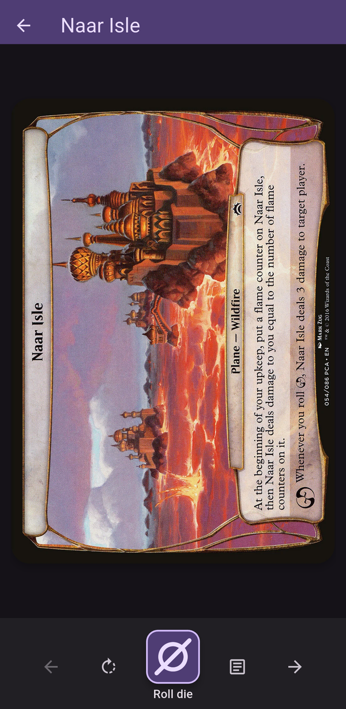
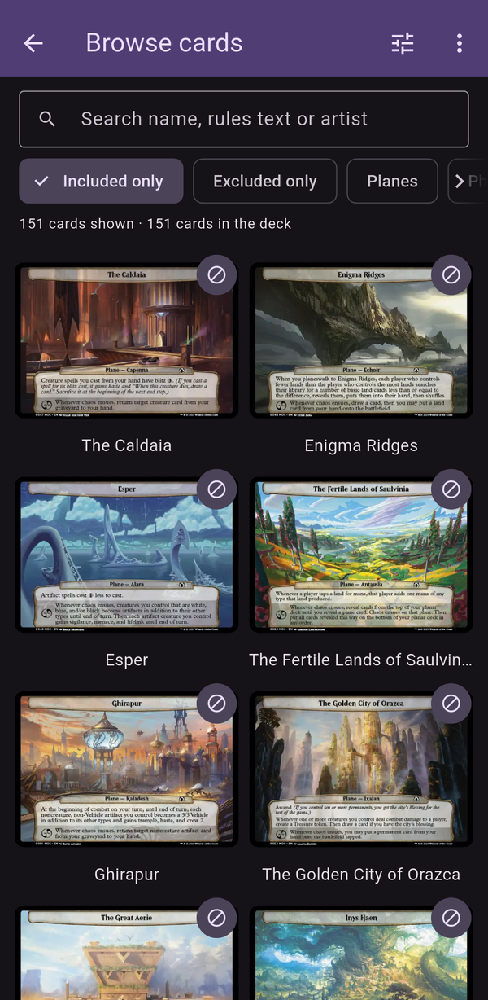

# Planespotting

A companion app for the Magic: The Gathering format Planechase. Draw a random plane, roll the planar die, and browse every card. Created by [Forrest](https://forrestthe.dev/).

<table>
  <tr>
    <td></td>
    <td></td>
  </tr>
  <tr>
    <td align="center">Play</td>
    <td align="center">Browse cards</td>
  </tr>
</table>

## Features

- Draws a random plane or phenomenon from your chosen sets and types, with swipe-back history, rotate and pinch/double-tap zoom.
- A planar die with a casino-style roll, an optional automatic planeswalk, and a card text panel with the artist credit.
- A card browser with search (name, rules text, artist) and filters (sets, types, included only, excluded only). Swipe or use the arrow keys to move between cards in the full-screen view.
- Deck settings in the browser: turn whole sets, Un-cards and types on or off, and exclude single cards from the deck.
- A switch to keep the screen on during a game.

## Install on Android (easiest)

1. On your phone, open the [latest release](https://github.com/Forrest22/planespotting/releases/latest) and download `planespotting-<version>.apk` (about 115 MB, since it holds every card image).
2. Open the downloaded file. Android will ask you to allow installs from your browser or file manager ("Install unknown apps"). Allow it for that app.
3. If Play Protect warns about an unknown developer, choose **Install anyway**. The app isn't on the Play Store.

New versions install over the old one and keep your settings.

## Build it yourself

Use this for Linux, Windows or macOS, or if you'd rather build the Android app than download it.

### 1. Install the tools

- [Git](https://git-scm.com/downloads) and [Python 3](https://www.python.org/downloads/).
- The [Flutter SDK](https://docs.flutter.dev/get-started/install) for your operating system, following Flutter's own guide for the platform you're building for.
- Run `flutter doctor` and fix whatever it flags for that platform.

### 2. Get the code and the card images

The card art is Wizards of the Coast's, so the images are not in the repo (`assets/cards/`, `assets/cards_thumb/` and `assets/planeschase/` are gitignored). `assets/cards.json` (card metadata) is tracked. Download the images once after cloning:

```sh
git clone https://github.com/Forrest22/planespotting.git
cd planespotting
pip install pillow
python3 tool/fetch_cards.py
flutter pub get
```

`fetch_cards.py` pulls all 206 paper planes and phenomena from [Scryfall](https://scryfall.com) (about 60 MB, a few minutes), saves them as WebP in `assets/cards/`, makes the 360 px thumbnails the browser uses in `assets/cards_thumb/`, and regenerates `assets/cards.json`. Re-running it skips images that already exist, so it also picks up newly released sets. `python3 tool/fetch_cards.py --thumbs-only` rebuilds just the thumbnails from the images you already have, without the network. If `pip install pillow` says `externally-managed-environment`, use a virtual environment (`python3 -m venv .venv && . .venv/bin/activate`) or your distro's package (`sudo apt install python3-pil` on Debian and Ubuntu).

### 3. Build and run

**Android phone.** Turn on Developer options and USB debugging on the phone ([how](https://developer.android.com/studio/debug/dev-options)), plug it in and accept the prompt on the phone. Then:

```sh
flutter devices                # your phone should be listed
flutter run --release          # builds, installs and starts the app
```

Or build an APK to install or share: `flutter build apk --release`. It ends up in `build/app/outputs/flutter-apk/app-release.apk`; install it with `adb install -r build/app/outputs/flutter-apk/app-release.apk`, or copy it to the phone and open it.

**Linux.** `flutter doctor` lists the packages to install (on Debian and Ubuntu: `sudo apt install clang cmake ninja-build pkg-config libgtk-3-dev`). Then `flutter run -d linux --release`, or `flutter build linux` and run `build/linux/x64/release/bundle/planespotting`.

**Windows.** Install Visual Studio with the "Desktop development with C++" workload, then `flutter build windows`. The app is `build\windows\x64\runner\Release\planespotting.exe`. *Not tested yet.*

**macOS.** Install Xcode, then `flutter build macos`. The app is `build/macos/Build/Products/Release/planespotting.app`. *Not tested yet.*

### Troubleshooting

- **The build fails because `assets/cards/` or `assets/cards_thumb/` is missing:** run `python3 tool/fetch_cards.py` (step 2).
- **On Linux the app crashes at start with `GLib-GIO-ERROR … does not contain a key named 'antialiasing'`:** you're running from VS Code's snap terminal, which leaks its own library paths. Run it from a normal terminal, or install VS Code from the `.deb` instead of the snap.
- **Android says "App not installed" when updating:** the old copy was signed with a different key. Uninstall it first (this clears your settings), then install again.
- **`flutter devices` doesn't list the phone:** check USB debugging is on, try another cable or port, and accept the "Allow USB debugging" prompt on the phone.

## Development

```sh
flutter pub get
flutter run                 # add -d linux / -d chrome for desktop / web
flutter analyze
flutter test
```

The tests use fakes, so they don't need the downloaded images. The Android launcher icon is generated from `assets/icon/` with `dart run flutter_launcher_icons`. There is no Linux window icon.

## Releasing (maintainer)

Release APKs are signed with a key that stays the same between versions, so people can update in place. Without `android/key.properties`, the build falls back to the debug key, which is fine for your own testing but not for sharing.

One-time setup:

```sh
keytool -genkey -v -keystore ~/planespotting-release.jks -keyalg RSA -keysize 2048 -validity 10000 -alias planespotting
```

Then create `android/key.properties` (gitignored, never commit it or the keystore):

```properties
storePassword=<the keystore password>
keyPassword=<the key password>
keyAlias=planespotting
storeFile=/home/<you>/planespotting-release.jks
```

Back up the keystore and its passwords. If you lose them, nobody can update in place any more and everyone has to uninstall first.

For each release:

1. Bump `version:` in `pubspec.yaml` (for example `1.1.0+2`; the number after `+` must go up every time).
2. `flutter build apk --release`, then copy `build/app/outputs/flutter-apk/app-release.apk` to `planespotting-<version>.apk`.
3. On GitHub, create a release tagged `v<version>` and attach that APK.

## Credits

Card images and data come from [Scryfall](https://scryfall.com), which is not affiliated with this app. Planespotting is unofficial Fan Content permitted under the Wizards of the Coast Fan Content Policy. It is not approved or endorsed by Wizards. Portions of the materials used are property of Wizards of the Coast. ©Wizards of the Coast LLC.

Notes to self:

- custom cards?
- plancheDH implementation?
